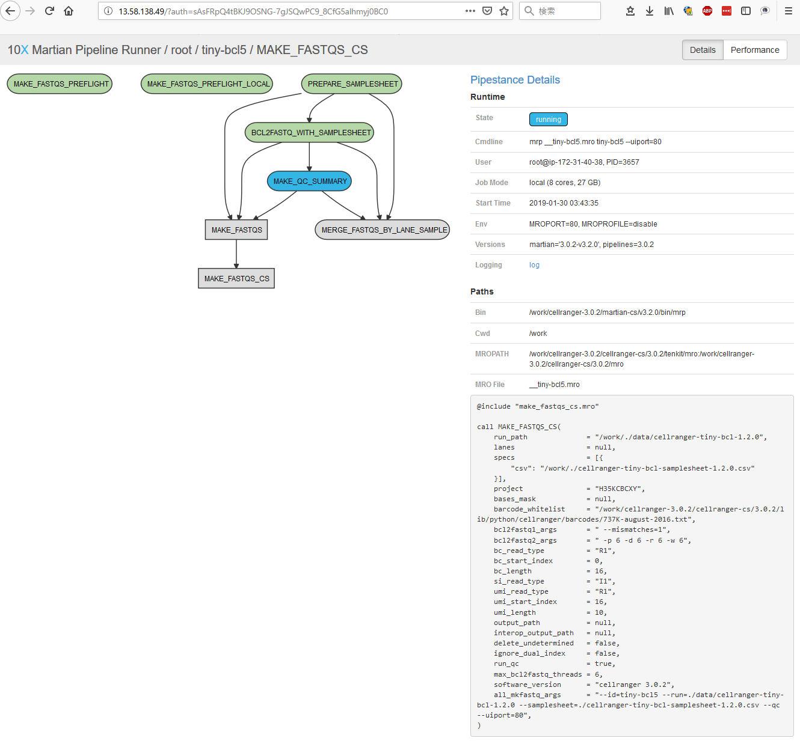

2019.7.31　作成　NCC

## Option. Cell Ranger ユーザインタフェースの利用

cellranger パイプラインにはユーザインターフェールが用意されています。  

公式ドキュメント：[The Cell Ranger User Interface](https://support.10xgenomics.com/single-cell-gene-expression/software/pipelines/latest/advanced/ui)

ユーザインターフェースの場所は実行ログに記載されています。

```Bash
$ cellranger mkfastq --id=tiny-bcl5 --run=./data/cellranger-tiny-bcl-1.2.0 --samplesheet=./cellranger-tiny-bcl-samplesheet-1.2.0.csv --qc --uiport=80
/work/cellranger-3.0.2/cellranger-cs/3.0.2/bin
cellranger mkfastq (3.0.2)
Copyright (c) 2019 10x Genomics, Inc.  All rights reserved.
-------------------------------------------------------------------------------

Martian Runtime - '3.0.2-v3.2.0'
Serving UI at http://ip-172-31-40-38:80?auth=sAsFRDQ4tBKJ9OGNG-7gJSWwPC9_8CfG3alhmyj0BC0 # <- ★ここ

Running preflight checks (please wait)...
（以下省略）
```

AWS インスタンスで実行している、内部ネットワークアドレスが表示されていますので、外部ネットワークアドレスに読み直してアクセスします。

インスタンスの外部ネットワークアドレスは以下のようにして取得することができます。

AWS マネジメントコンソールから ec2 サービスを選択します。  
左端のメニューから「インスタンス」を選択した後、目的のインスタンスを選択します。  
右下にインスタンスの情報が記載されていますので、そこから「IPv4 パブリック IP」を探します。  
なお、内部ネットワークアドレスは「プライベート IP」という名前で記載されています。


外部ネットワークアドレスに読み替えるとユーザインターフェースの URL は以下のようになります。

http://13.58.138.49:80?auth=sAsFRDQ4tBKJ9OGNG-7gJSWwPC9_8CfG3alhmyj0BC0

ブラウザで開くと以下のような画面が表示されます。



より詳しい解説は [The Cell Ranger User Interface](https://support.10xgenomics.com/single-cell-gene-expression/software/pipelines/latest/advanced/ui) を参照してください。

---

※ 注意１  

AWS インスタンスにはセキュリティグループがあり、ポート番号を指定してアクセスを許可する必要があります。  
以下の手順で設定します。  

AWS マネジメントコンソールから ec2 サービスを選択します。  
左端のメニューから「インスタンス」を選択した後、現在のインスタンスを選択します。  
右下にインスタンスの情報が記載されていますので、そこから「セキュリティグループ」のリンクをクリックします。  


セキュリティグループの画面が表示されますので、「インバウンド」→「編集」とクリックして、セキュリティグループの編集画面を表示します。  
「ルールの追加」ボタンをクリックして行を追加し、ポート番号を入力します。  
アクセスを許可する IP アドレス範囲 (「マイIP」を選択すると、現在の自分のIPアドレスを設定できます) を入力したら「保存」を押してください。


※ 注意２  
公開ポートはランダムなため、 `--uiport=3600` のように `--uiport` オプションをつけることで固定することができます。  

ただし、Linux では TCP/IP ポート番号のうち 1024 未満は特権ポート (privileged ports) といい、特権プロセス（CAP_NET_BIND_SERVICE ケーパビリティを持つプロセス）でないとアクセスできません。  
そのため、3600 など 1024 以上のポート番号を指定したほうがよいでしょう。  

---

以上です。
不要になった AWS インスタンスは適宜停止するか削除してください。

 - [AWS EC2 を利用する場合](./aws_ec2_instance.html)
 - [AWS Cloud9 を利用する場合](./aws_cloud9.html)

