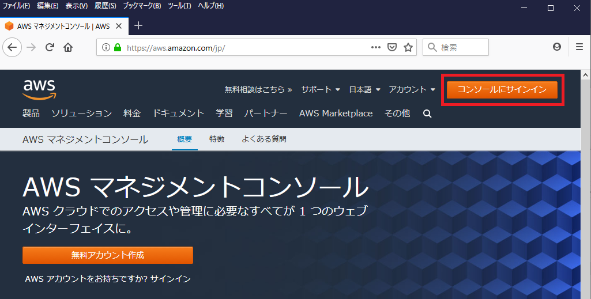
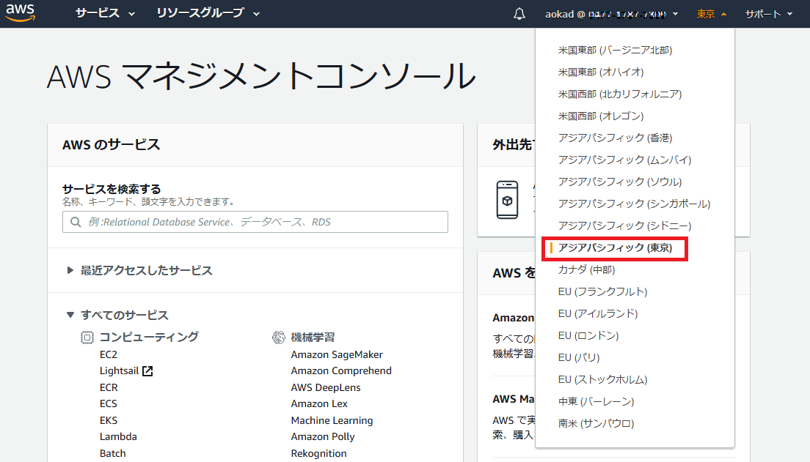
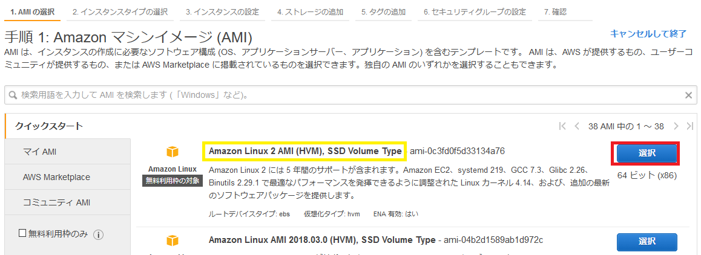
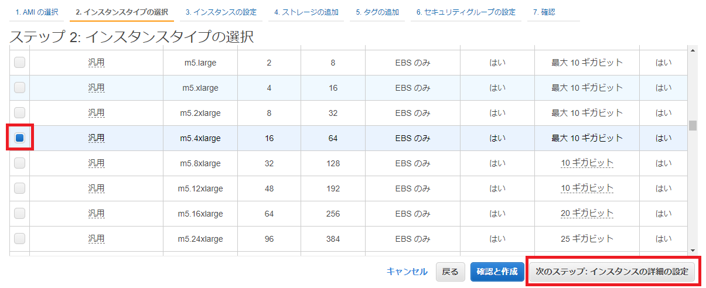
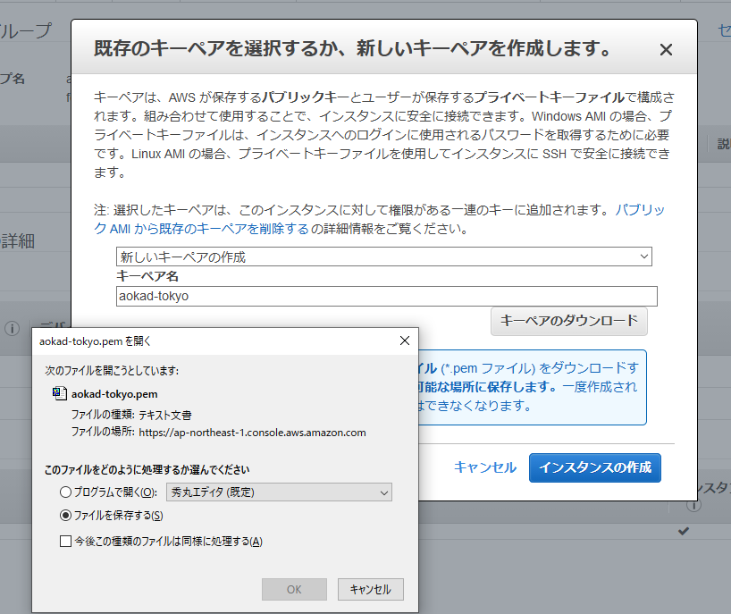
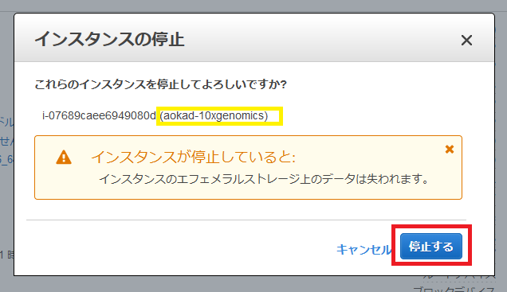
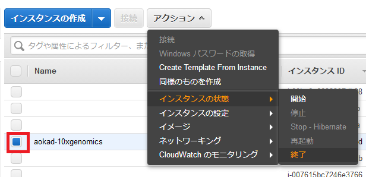
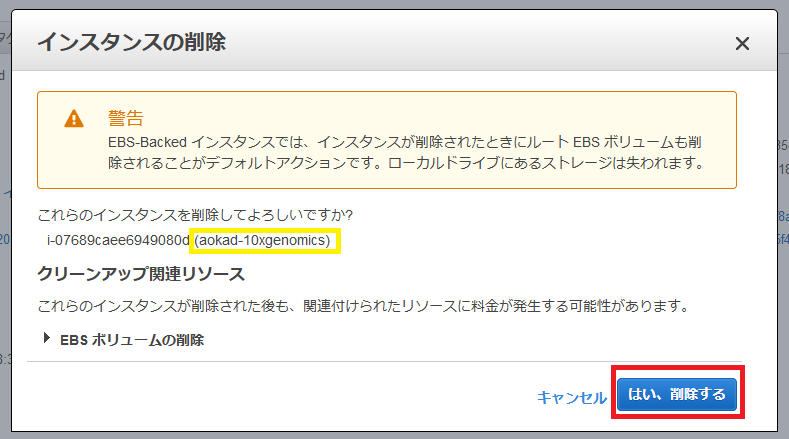
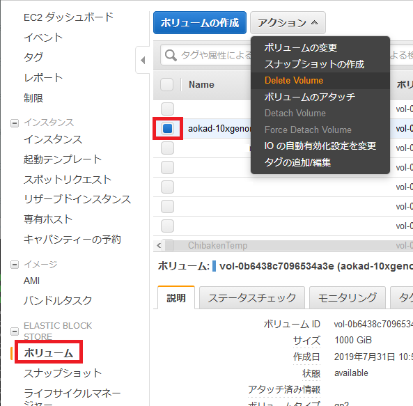
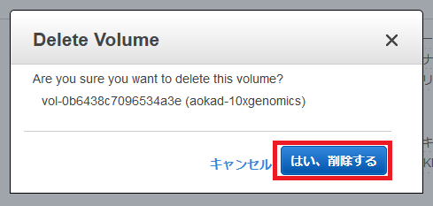

2019.7.31　作成　NCC

# AWS EC2 を使用して Linux サーバを構築する

## 1. AWS コンソールにログイン

https://aws.amazon.com を web ブラウザで開き、「コンソールにサインイン」をクリックします。



次の画面でアカウント、ユーザ名、パスワードを入力します。


AWS マネジメントコンソールで東京リージョンを選択しておきます。



## 2. EC2 インスタンスの起動

AWS マネジメントコンソールで EC2 サービスを選択します。


EC2 ダッシュボードが表示されますので、「インスタンスの作成」ボタンを押します。


まず最初にマシンイメージを選択します。今回はAmazon Linux2 AMI (HVM) を使用します。  
マシンイメージ名の横にある「選択」ボタンを押します。



次にインスタンスタイプを選択します。今回はt3.2xlargeを使用します。  
インスタンスタイプ名の先頭にあるチェックボックスを選択したら、ページの最後にある「次の手順」ボタンを押します。



「インスタンスの詳細の設定」では何もせず、ページの最後にある「次の手順」ボタンを押します。


「ストレージの追加」では 1T のボリュームを追加します。  
まず、「新しいボリュームの追加」ボタンを押して行を追加し、サイズを「1000」と入力します。  
入力後、ページの最後にある「次の手順」ボタンを押します。


「タグの追加」では作成するインスタンスに名前をつけます。  
必須ではありませんが、名前がついていた方が管理しやすくなります。  
まず、「タグの追加」ボタンを押して行を追加し、キーに「Name」、値に名前 (任意の英数字) を入力します。  
入力後、ページの最後にある「次の手順」ボタンを押します。


最後は「セキュリティグループの設定」です。  
今回は新しくセキュリティグループを作成しますが、既存のグループがあればそちらを選択しても構いません。  
まず「セキュリティグループ名」「説明」を入力します。  
タイプ「SSH」を選択し、ソースにアクセスを許可しようとしている IP アドレスを入力します。「マイIP」を選択すると、現在の自分のIPアドレスを設定することができます。  
入力後、ページの最後にある「確認と作成」ボタンを押します。


確認画面が表示されますので、問題なければ「起動」ボタンを押してください。


キーペアの選択画面が表示されます。  
ここでは新しいキーペアを作成しますが、既存のキーペアがある場合はそちらを使用しても構いません。  
「キーペア名」を入力し、「キーペアのダウンロード」ボタンを押します。  


今回作成するキーペアはここでしかダウンロードできません。大切に保管してください。  



キーペアをダウンロードしたら、「インスタンスの作成」ボタンを押します。


作成ステータス画面が表示されます。「インスタンスの表示」ボタンを押します。


EC2 インスタンスリストが表示されます。  
今回作成したインスタンスはまだ作成中であることが分かります。


「チェックに合格しました」と表示されれば使用可能です。


## 3. 作成したインスタンスに SSH ログイン

先ほどのインスタンスリストで今回作成したインスタンスのパブリック DNS をコピーしておきます。


ターミナルを開きます。  

1) 先ほどダウンロードしたキーペアのパーミッションを変更します。  
ここでは `~/.ssh/` の下に保存していますが、適宜読み替えてください。  

2) 次に `ssh` コマンドで作成したインスタンスにログインします。  
Amazon Linux の場合、ユーザ名は `ec2-user` 固定です。  
サーバのアドレスは先ほどコピーしたパブリック DNS を張り付けてください。

3) 続けますかと聞かれたら `yes` と入力してください。


ログインできましたか？

## 4. work ディレクトリの準備

アタッチしたディスクが存在するかを確認します。

```Bash
$ ls /dev/sdb
/dev/sdb
```

フォーマットします。

```Bash
$ sudo mkfs -t ext4 /dev/sdb
mke2fs 1.42.9 (28-Dec-2013)
Filesystem label=
OS type: Linux
Block size=4096 (log=2)
Fragment size=4096 (log=2)
Stride=0 blocks, Stripe width=0 blocks
65536000 inodes, 262144000 blocks
13107200 blocks (5.00%) reserved for the super user
First data block=0
Maximum filesystem blocks=2409627648
8000 block groups
32768 blocks per group, 32768 fragments per group
8192 inodes per group
Superblock backups stored on blocks:
        32768, 98304, 163840, 229376, 294912, 819200, 884736, 1605632, 2654208,
        4096000, 7962624, 11239424, 20480000, 23887872, 71663616, 78675968,
        102400000, 214990848

Allocating group tables: done
Writing inode tables: done
Creating journal (32768 blocks): done
Writing superblocks and filesystem accounting information: done
```

work ディレクトリにマウントします。

```Bash
$ sudo mkdir /work
$ sudo mount /dev/sdb /work
$ df -h
Filesystem      Size  Used Avail Use% Mounted on
devtmpfs         16G     0   16G   0% /dev
tmpfs            16G     0   16G   0% /dev/shm
tmpfs            16G  448K   16G   1% /run
tmpfs            16G     0   16G   0% /sys/fs/cgroup
/dev/nvme0n1p1  8.0G  1.2G  6.8G  15% /
tmpfs           3.2G     0  3.2G   0% /run/user/0
tmpfs           3.2G     0  3.2G   0% /run/user/1000
/dev/nvme1n1    985G   77M  935G   1% /work
```

work ディレクトリのパーミッションを変更します。

```Bash
$ touch /work/file1
touch: cannot touch ‘/work/file1’: Permission denied
$ sudo chown ec2-user /work
$ touch /work/file1
$ ls -l /work
total 16
-rw-rw-r-- 1 ec2-user ec2-user     0 Jul 31 02:35 file1
drwx------ 2 root     root     16384 Jul 31 02:28 lost+found
```

## 3. 片付け

### 3.1 ターミナルから抜ける

`exit` でログアウトします。

```Bash
$ exit
logout
Connection to ec2-52-194-226-103.ap-northeast-1.compute.amazonaws.com closed.
```

### 3.2 インスタンスを停止する

インスタンスを起動したままでは課金対象になってしまいますので、使用しない場合は停止しておきます。  
ただし、ディスクは停止した状態であっても課金対象となりますので、無課金状態にはなりません。  

※完全に削除したい場合はこの項目を飛ばして、次の 「3.3 インスタンスを削除する」に進んでください。

AWS マネジメントコンソールから作成したインスタンスを選択し、「アクション」→「インスタンスの状態」とたどって「停止」をクリックします。


確認画面が表示されますので、停止したいインスタンスを十分に確認したら「停止する」ボタンを押します。



停止処理が始まりました。


完全に停止すると「stopped」と表示されます。


### 3.3 インスタンスを削除する

必要のないインスタンスは削除します。

AWS マネジメントコンソールから作成したインスタンスを選択し、「アクション」→「インスタンスの状態」とたどって「終了」をクリックします。



確認画面が表示されますので、削除したいインスタンスを十分に確認したら「はい、削除する」ボタンを押します。



削除されたインスタンスは「terminated」と表示されます。一定期間表示されますが、その後リストからも消えます。


アタッチしたボリュームを削除します。  
※インスタンス削除時、一緒に削除する設定にしていた場合はすでに削除されていますので、この操作は必要ありません。

左端のメニューから「ボリューム」を選択し、ボリュームを表示します。  
今回作成したボリュームを選択した後、「アクション」→「Delete Volume」をクリックします。



確認画面が表示されますので、内容を確認したら、「はい、削除する」ボタンを押します。



今回作成したセキュリティグループを削除します。

左端のメニューから「セキュリティグループ」を選択し、セキュリティグループを表示します。  
今回作成したセキュリティグループを選択した後、「アクション」→「セキュリティグループの削除」をクリックします。


確認画面が表示されますので、内容を確認したら、「はい、削除する」ボタンを押します。


今回作成したキーペアを削除します。

左端のメニューから「キーペア」を選択しキーペアを表示します。  
今回作成したキーペアを選択した後、「削除」ボタンを押します。


確認画面が表示されますので、内容を確認したら、「はい」ボタンを押します。


